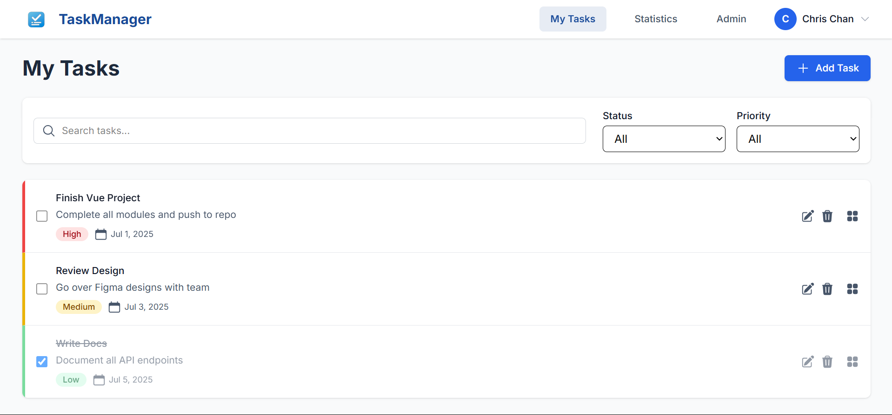

# 🗂️ Task Manager Monorepo

A full-stack Task Management System built with:

- **Backend:** Laravel 11 (PHP 8.2+, Dockerized with MySQL 8)
- **Frontend:** Vue 3 (Vite, Composition API, Pinia, TailwindCSS)

---

---

## 📸 Screenshot




## 📁 Project Structure

This monorepo contains:

```bash
    task-manager/
    ├── backend/ # Laravel backend code (Dockerized)
    ├── frontend/ # Vue 3 frontend code (Vite)
    └── README.md # Setup instructions + API documentation
---

---

## 🚀 Quick Start

### ✅ Prerequisites

- [Docker + Docker Compose](https://docs.docker.com/get-docker/)
- Node.js v20.19.3
- NPM or Yarn

---

## 🔧 Setup Instructions

### 1. Clone the Repository

```bash
git clone https://github.com/your-username/task-manager.git
cd task-manager

## Backend Setup (Laravel + Docker)
### Configure Environment
```bash

    cd backend
    cp .env.example .env

    # Edit .env to match Docker services:

    # .env
    #     DB_CONNECTION=mysql
    #     DB_HOST=db
    #     DB_PORT=3306
    #     DB_DATABASE=task_manager
    #     DB_USERNAME=laravel
    #     DB_PASSWORD=secret

    #     SANCTUM_STATEFUL_DOMAINS=localhost:5173
    #     APP_URL=http://localhost:8000


    # Start Docker Containers
    docker compose up -d --build

    docker exec -it task-manager-app bash

    # inside container
    composer install
    php artisan key:generate
    php artisan migrate
    php artisan db:seed  # Optional
    exit

---
    ### Frontend
    ## Navigate to the backend directory:
   ```bash
    cd frontend

    # Install dependencies
    npm install

    # Run the development server
    npm run dev

    # Test user account
    # email: 'chris@test.com'
    # password: 'password'
